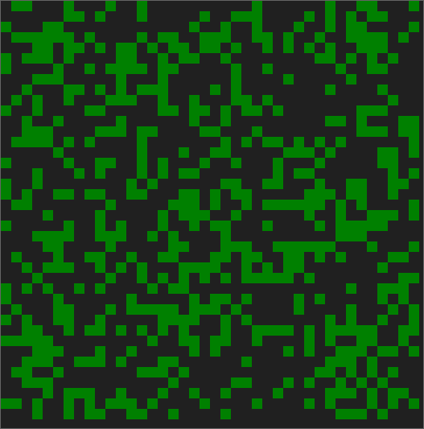
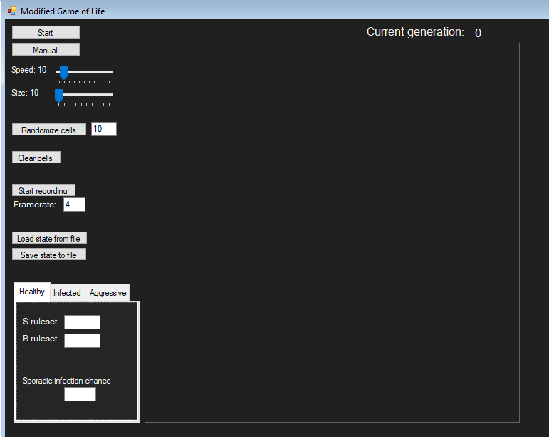

# User documentation

Modified Game of Life is a GUI program to simulate and customize it to a high degree. 

    

## Table of Contents

- [Getting Started](#getting-started)
    - [Prerequisites](#prerequisites)
    - [Installation](#installation)
- [Using the program](#usage)
    - [UI layout walkthrough](#layout)
    - [Feedback](#feedback)

## Getting started

### Prerequisities

- Up-to-date Windows operating system

### Installation

- Follow to the release tab on this Github page
- Choose a version (preferably the latest) that suits you and follow the instructions on that release.

## Usage

### Layout

The program is comprised of a singular GUI window. The UI of the program looks like this:

Firstly we will go through the controls on the left side of the screen:
1. The `Start` button allows for the simulation to iterate automatically. If it currently is, the button will say `Stop` instead. Then you can use this button to stop the simulation
2. The `Manual` button allows you to increment the simulation manually, one generation per click.
3. The `Speed` slider allows you to control how fast the simulation is when it is generated automatically. The unit is generations per second.
4. The `Size` slider allows you to control how big the cells panel (on the right) is. Whatever the value is, the panel will resize itself to be a square with side lengths of that value.
5. The `Clear cells` button allows you to wipe the entire cells pannel clean, i.e. kill all of the cells.
6. The `Randomize cells` button allows you to fill the whole cells panel with random healthy cells (about those right after this). The textbox right next to it controls to what degree. You can input any integer between 1 and 100. This value is a percentage, that dictates how likely each cell is to become a healthy cell, otherwise it just dies.

There are 3 types of cells:
- Healthy
    - these just live and die according to the rules set; equivalent to the cells in the original Game of Life
    - is represented as green on the cells panel
- Infected
    - these have "contracted" a virus
    - after a set incubation period they either heal, or become aggresive
    - is represented as orange on the cells panel
- Aggressive
    - these are killer cells
    - they eat all unaggressive cells in the vicinity
    - if they dont eat for a set period of time, they die
    - is represented as red on the cells panel

7. The `Start recording` button allows you to start a recording session. Before starting the recording, set the framerate right below. This value is how many frames per second the resulting GIF will have. Input any integer greater or equal to 1. This value is locked after the recording has started. After starting the session, whatever happens on the cells panel will be on the resulting GIF. The button itself turns into `Stop recording` after the session has started. After pressing it, the session terminates and a Save file dialog pops open. Just select whichever location you want and press Save. In the set location, there will be the resulting GIF.
8. The `Load state from file` and `Save state to file` buttons allow you to keep a representation of the current state onto your disk. If you find a configuration that you find cool, just save it via the `Save state to file` button. This will open a save file dialog. Just input the location as with the recording and you're done. This will create a JSON file in the desired location with the desired name. This file encompassess the current cells panel state as well as all the configuration. You can then retrieve it via the `Load state from file` button. Just select it in the Open file dialog and the current state will be loaded and replaced.
DO NOT edit this file directly. Although possible, messing up the JSON structure as well as inputing invalid data may result in undefined behavior in the simulation. If you want to make any edits after saving, load it again, make the edits and then save it again.
9. Next up is a sub-window to configure each of the possible states of organisms. First of all, whichever window is selected determines which type of organism you have "equipped". You can actually interact with the cells panel by clicking onto it. The corresponding cell will then either:
- empty if the was a prior occupier
- fill with a new instance of the organism that you have currectly selected on the chooser tab if it was empty prior

The corresponding configurations of each organisms are hereby explained:
- Healthy
    - `S ruleset`
        - Input all the possible amounts of neighbors, one of which a healthy cell needs to have in its vicinity (i.e. the 8 cells around it) to survive. You can input numbers from 0 to 8. Put them in any order.
        - The default is `23` - the classic Game of Life S rule. This means that a healthy cell needs to have exactly 2 or 3 neighbors in order to survive. 
    - `B ruleset`
        - Input all the possible different amounts of neighbors that an empty cell can have in vicinity (i.e. the 8 cells around it) to become a healthy cell. You can input numbers from 0 to 8. Put them in any order.
        - The default is `3` - the classic Game of Life B rule. This means that an empty cell needs to have exactly 3 neighbors in order to survive.
    - `Sporadic infection chance`
        - Input a percentage that denotes the probability a healthy cell sporadically gets infected when the generation is changing. The default is 0%, i.e. it never does.
- Infected
    - `Incubation period`
        - Input the number of iterations it takes an infected cell until its "decision day" - when it either heals or turns aggressive.
    - `Chance of healing`
        - Input the percentage denoting the probability that an infected cell heals at the end of its incubation period.
- Aggressive
    - `Hunger strike threshold`
        - Input a positive integer that denotes the number of days without eating it takes for an aggressive cell to die.

There is also a generation tracker above the cells panel. That denotes the number of iterations the Game has been through **since last edit**. That means, if you make any edit to the simulation configuration on the fly,  
## Feedback

If you have any issues, suggestions or questions in relation to this project, open an issue right here on Github. Please, just search through them at first, to try and see if someone before you has encountered the same issue, etc.
